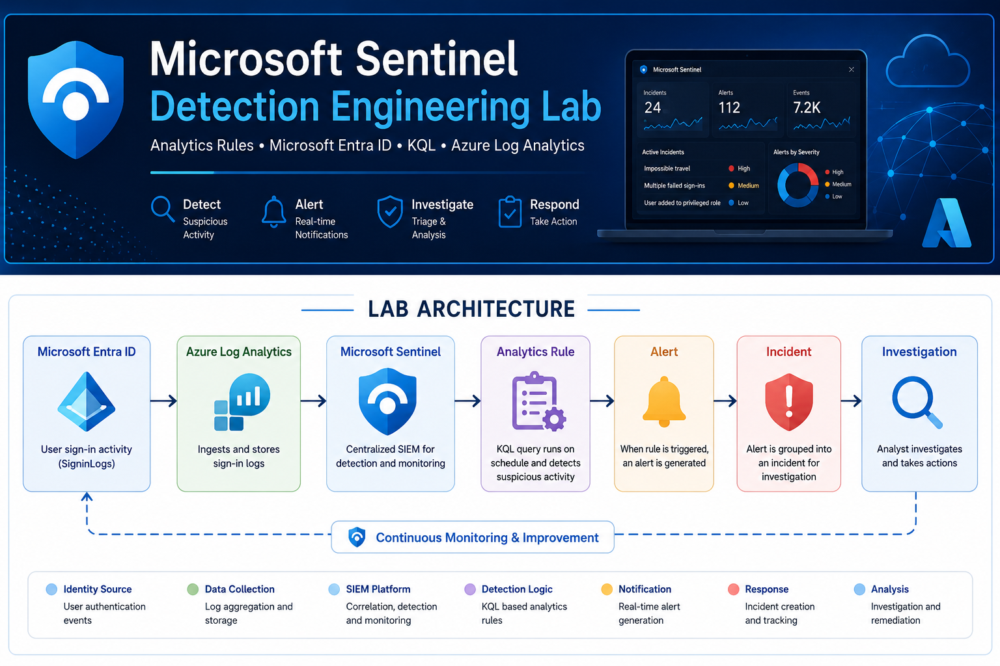
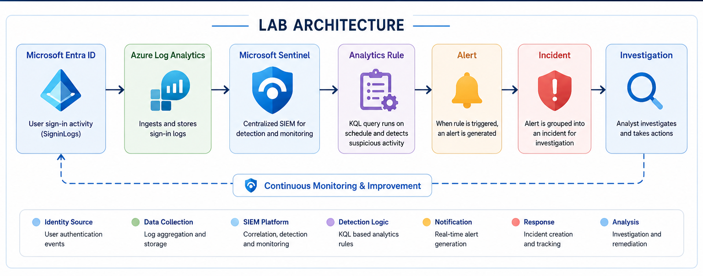
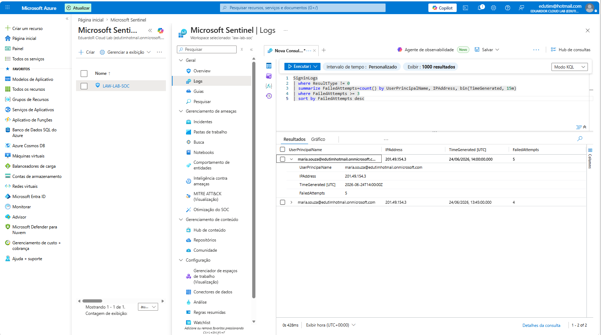
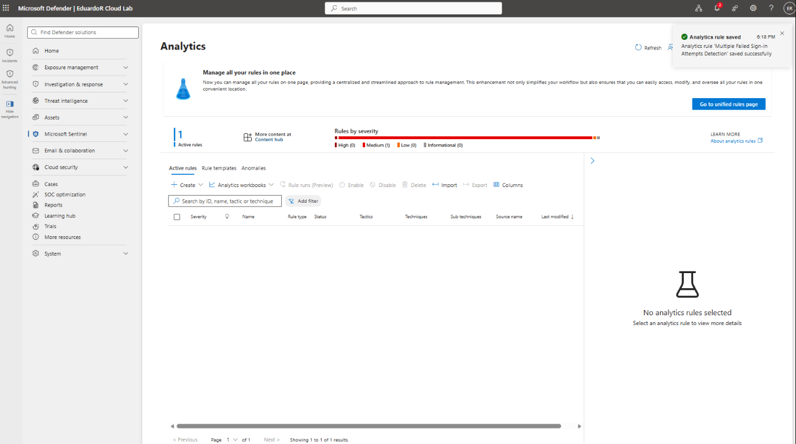
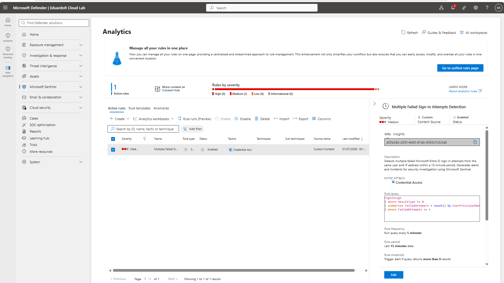
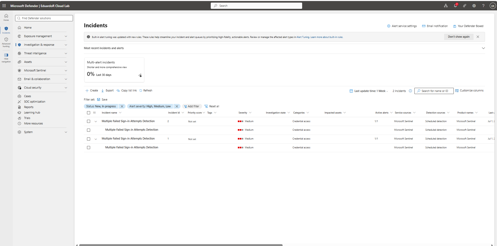
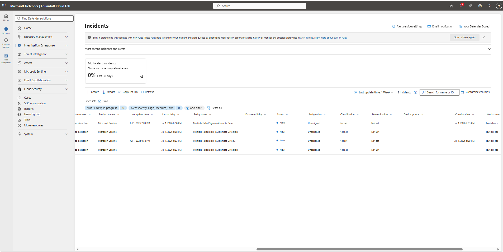
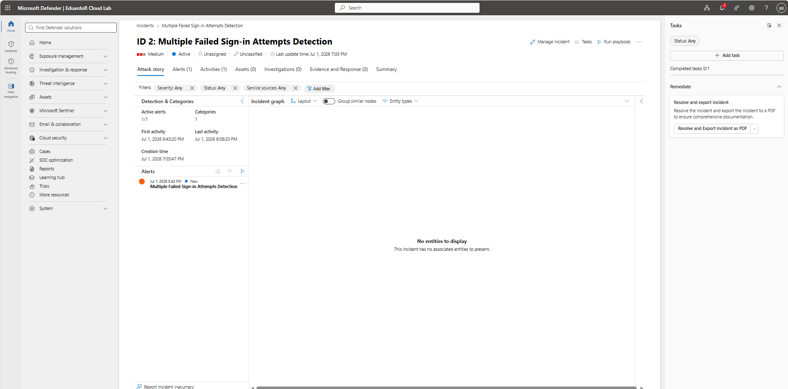

# Microsoft Sentinel Detection Engineering Lab

<p align="center">

</p>

<p align="center">
Detection Engineering • Microsoft Sentinel • Analytics Rules • Microsoft Entra ID • KQL • Azure Log Analytics
</p>


---

# Skills Demonstrated

- Microsoft Sentinel
- Microsoft Entra ID
- Azure Log Analytics Workspace
- Kusto Query Language (KQL)
- Detection Engineering
- Analytics Rules
- Scheduled Rules
- Alert Generation
- Incident Creation
- Incident Investigation
- MITRE ATT&CK Mapping
- Cloud Security

---

# Project Highlights

- Created a custom Microsoft Sentinel Analytics Rule
- Built a scheduled detection using KQL
- Detected multiple failed Microsoft Entra ID sign-in attempts
- Generated Microsoft Sentinel alerts automatically
- Created incidents automatically from alerts
- Configured MITRE ATT&CK mapping
- Validated the detection using Azure Log Analytics

---

# Overview

This lab demonstrates how Microsoft Sentinel can be used to create custom detection rules capable of identifying suspicious authentication activity from Microsoft Entra ID.

A scheduled Analytics Rule was developed using Kusto Query Language (KQL) to monitor multiple failed sign-in attempts from the same user and IP address within a defined time window.

Once the detection criteria were met, Microsoft Sentinel automatically generated alerts and created incidents for investigation, demonstrating a basic Detection Engineering workflow.

---

# Lab Architecture

<p align="center">

</p>

---

# Technologies Used

| Component | Technology |
|-----------|------------|
| Cloud Platform | Microsoft Azure |
| Identity Provider | Microsoft Entra ID |
| SIEM | Microsoft Sentinel |
| Log Storage | Azure Log Analytics Workspace |
| Query Language | Kusto Query Language (KQL) |

---

# Detection Workflow

## 1. KQL Detection Query

The following KQL query identifies users generating three or more failed authentication attempts within a 15-minute period.

```kusto
SigninLogs
| where ResultType != 0
| summarize FailedAttempts = count()
    by UserPrincipalName,
       IPAddress,
       bin(TimeGenerated, 15m)
| where FailedAttempts >= 3
| sort by FailedAttempts desc
```

<p align="center">

</p>

---

## 2. Custom Analytics Rule Created

A Scheduled Analytics Rule was created using the detection query.

The rule was configured to:

- Run every 5 minutes
- Analyze the previous 15 minutes
- Generate alerts
- Map the detection to MITRE ATT&CK Credential Access

<p align="center">

</p>

---

## 3. Analytics Rule Enabled

After validation, the Analytics Rule was successfully enabled inside Microsoft Sentinel.

<p align="center">

</p>

---

## 4. Automatic Incident Creation

When the rule conditions were met, Microsoft Sentinel automatically generated a security incident.

<p align="center">

</p>

---

## 5. Incident List

The incident appeared in the Microsoft Defender portal, demonstrating the successful integration between Sentinel Analytics Rules and Defender Incidents.

<p align="center">

</p>

---

## 6. Incident Investigation

The generated incident contains:

- Alert information
- Detection category
- Severity
- Timeline
- Investigation interface
- Response workflow

<p align="center">

</p>

---

# Investigation Results

The Detection Engineering workflow successfully demonstrated how Microsoft Sentinel can automate the identification of suspicious authentication behavior.

The custom Analytics Rule successfully:

- Detected multiple failed sign-in attempts
- Generated security alerts
- Created incidents automatically
- Integrated with Microsoft Defender
- Supported incident investigation
- Applied MITRE ATT&CK classification

---

# Repository Structure

```text
.
│
├── images
│   ├── banner.png
│   ├── architecture.png
│   ├── 01-kql-query.png
│   ├── 02-analytics-rule-created.png
│   ├── 03-rule-enabled.png
│   ├── 04-incident-created.png
│   ├── 05-incidents.png
│   └── 06-incident-details.png
│
├── README.md
```

---

# Lessons Learned

During this lab, I gained practical experience with:

- Building custom Analytics Rules in Microsoft Sentinel
- Writing KQL detection logic
- Creating scheduled detections
- Monitoring Microsoft Entra ID authentication logs
- Automating alert generation
- Automating incident creation
- Investigating Microsoft Sentinel incidents
- Applying Detection Engineering concepts
- Mapping detections to MITRE ATT&CK

---

# Future Improvements

- Create additional Analytics Rules for other attack scenarios
- Implement Entity Mapping
- Configure Automation Rules
- Integrate Logic Apps playbooks
- Create Microsoft Sentinel Workbooks
- Expand detection coverage using Threat Intelligence
- Implement UEBA-based detections

---

# Author

**Eduardo Rodrigues**

Infrastructure Analyst | Azure | Microsoft Sentinel | IAM | Cloud Security

- LinkedIn: https://linkedin.com/in/eduardoordorodrigues
- GitHub: https://github.com/eduardoordg
